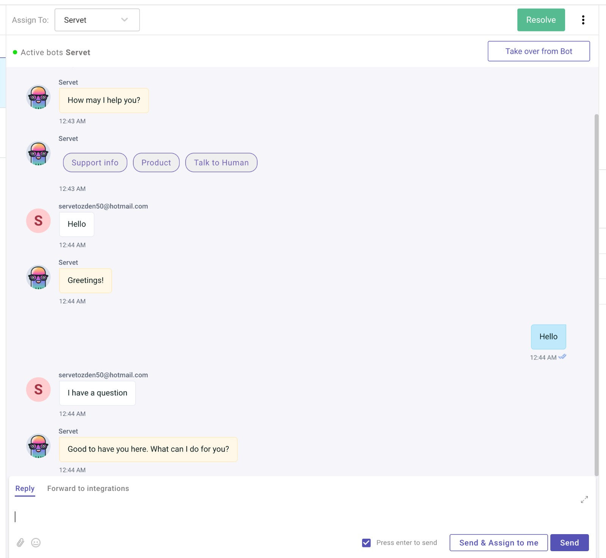

# KommunicateChat
 Live Chat<dt>
Kommunicate is live chat and chatbots powered customer support software. It is an important software for the support team. It can instantly help the customer who has a problem within the application.

I got help https://docs.kommunicate.io/docs/android-installation.html web site and kommunicate own github account

I used 2 modules available in kommunicate github account  

You need to create a key on the Kommunicate site.<dt>

## Kommunicate Signup Screen <dt>

You must enter your information that you are a member on the communication site <dt>
 <dt>

## Kommunicate Chat Screen <dt>

You can edit automatic texts on the kommunicate dashboard. <dt>

## Kommunicate Chat Dashboard <dt>
You can reply instantly from the Communicate panel.<dt>

